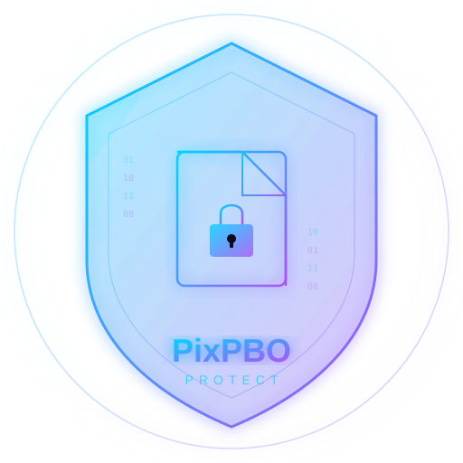

# PixPBO Protect

> **Proteja, compacte e assine seus mods DayZ com seguranca.**



## Sobre

PixPBO Protect e uma ferramenta profissional para proteger mods DayZ em `.pbo` contra copia e roubo. Oferece obfuscacao segura de scripts, assinatura digital, limpeza e empacotamento otimizado para rodar no servidor.

**Importante:** Esta ferramenta deve ser usada apenas para proteger mods proprios ou autorizados pelo usuario.

## Funcionalidades

- **Analisar PBO** - Examine a estrutura completa do seu mod
- **Obfuscar Scripts** - Proteja seus scripts `.c` com 3 niveis de obfuscacao
- **Limpar Arquivos** - Remova arquivos desnecessarios (thumbs.db, desktop.ini, etc.)
- **Reempacotar PBO** - Empacote seu mod otimizado em novo `.pbo`
- **Assinar Mod** - Gere `.bikey` e `.bisign` para validacao no servidor
- **Pipeline Completo** - Execute todas as etapas automaticamente
- **Gerar Relatorio** - Relatorio detalhado com todas as operacoes
- **Sistema de Licenca** - Protecao por chave com Bot Discord para gerenciamento

## Obfuscacao

### Niveis

| Nivel | Funcoes |
|-------|---------|
| Leve | Remove comentarios e espacos desnecessarios |
| Medio | + Renomeia variaveis locais, compacta codigo |
| Forte | + Renomeia funcoes internas, compactacao agressiva |

### Seguranca da Obfuscacao

- Preserva classes publicas DayZ
- Nao quebra `modded class`, `override`, `RPC`, `inputs`
- Mantem `config.cpp` e herancas funcionais
- Cria backup antes de qualquer alteracao

## Requisitos

- Windows 10/11
- Node.js 18+
- (Opcional) Electron instalado globalmente

## Instalacao

### Via Codigo Fonte

```bash
# Clone o repositorio
git clone https://github.com/seu-user/pixpbo-protect.git
cd pixpbo-protect

# Instale dependencias
npm install

# Execute
npm start
```

### Build para Windows

```bash
# Build automatico
build.bat

# Ou manualmente
npm run build
```

O instalador sera gerado em `dist/`.

## Estrutura de Pastas

```
pixpbo-protect/
├── src/
│   ├── main/           # Processo principal Electron
│   │   ├── main.js     # Entry point
│   │   └── preload.js  # Bridge seguro
│   ├── renderer/       # Interface grafica
│   │   ├── index.html  # Layout principal
│   │   ├── styles.css  # Tema dark/neon
│   │   └── app.js      # Logica da UI
│   ├── utils/          # Modulos de funcionalidade
│   │   ├── pbo-manager.js      # Analise e empacotamento PBO
│   │   ├── obfuscator.js       # Engine de obfuscacao
│   │   ├── file-cleaner.js     # Limpeza de arquivos
│   │   ├── mod-signer.js       # Assinatura digital
│   │   ├── report-generator.js # Geracao de relatorios
│   │   ├── license-manager.js  # Sistema de licenca
│   │   ├── backup-manager.js   # Gerenciamento de backups
│   │   └── logger.js           # Sistema de logs
│   └── assets/         # Imagens e icones
│       └── logo.svg    # Logo PixPBO
├── discord-bot/        # Bot Discord para licencas
│   ├── bot.js          # Codigo do bot
│   ├── config.json     # Configuracao
│   └── package.json    # Dependencias
├── Backups/            # Backups automaticos
├── Output/             # Arquivos processados
├── Logs/               # Logs de operacao
├── Keys/               # Chaves de assinatura
├── Temp/               # Arquivos temporarios
├── package.json        # Dependencias do app
├── build.bat           # Script de build Windows
└── README.md           # Este arquivo
```

## Bot Discord

O bot gerencia as licencas do PixPBO Protect via comandos slash no Discord.

### Configuracao do Bot

1. Crie um bot em https://discord.com/developers/applications
2. Copie o token
3. Edite `discord-bot/config.json`:

```json
{
  "token": "SEU_TOKEN_AQUI",
  "clientId": "ID_DO_CLIENTE",
  "guildId": "ID_DO_SERVIDOR",
  "adminRoleId": "ID_DO_CARGO_ADMIN",
  "maxKeysPerUser": 3
}
```

4. Instale e execute:

```bash
cd discord-bot
npm install
node bot.js
```

### Comandos do Bot

| Comando | Descricao |
|---------|-----------|
| `/gerar-key [dias] [tier]` | Gera nova chave de licenca |
| `/verificar-key [key]` | Verifica status da chave |
| `/minha-key` | Mostra suas chaves ativas |
| `/revogar-key [key]` | Revoga uma chave (admin) |
| `/listar-keys` | Lista todas as chaves (admin) |
| `/pixpbo-help` | Mostra ajuda |

### Manter Bot 24/7

Para manter o bot rodando 24/7, recomendamos:

- **VPS** (Recomendado): DigitalOcean, Vultr, ou similar
- **PM2**: Gerenciador de processos Node.js

```bash
npm install -g pm2
pm2 start discord-bot/bot.js --name "pixpbo-bot"
pm2 save
pm2 startup
```

## Fluxo de Uso

1. Abra o PixPBO Protect
2. Insira sua chave de licenca (obtida pelo bot Discord)
3. Selecione a pasta do mod ou arquivo `.pbo`
4. Clique em "Analisar" para ver a estrutura
5. Escolha o nivel de obfuscacao
6. Execute o Pipeline Completo ou funcoes individuais
7. Resultado entregue em `Output/`

## Tecnologias

- **Electron** - Framework desktop cross-platform
- **Node.js** - Runtime JavaScript
- **Discord.js** - Integracao com Discord
- **Winston** - Sistema de logs
- **ADM-ZIP** - Manipulacao de arquivos ZIP
- **Crypto** - Criptografia e assinaturas

## Seguranca

- Backup automatico antes de qualquer alteracao
- Nunca sobrescreve o arquivo original
- Aviso se detectar risco de quebrar o mod
- Chaves de licenca criptografadas localmente
- Nao expoe ou armazena dados sensiveis

## Licenca

MIT License - Uso responsavel apenas para protecao de mods proprios/autorizados.

---

**PixPBO Protect** - Feito para devs DayZ que valorizam seu trabalho.
